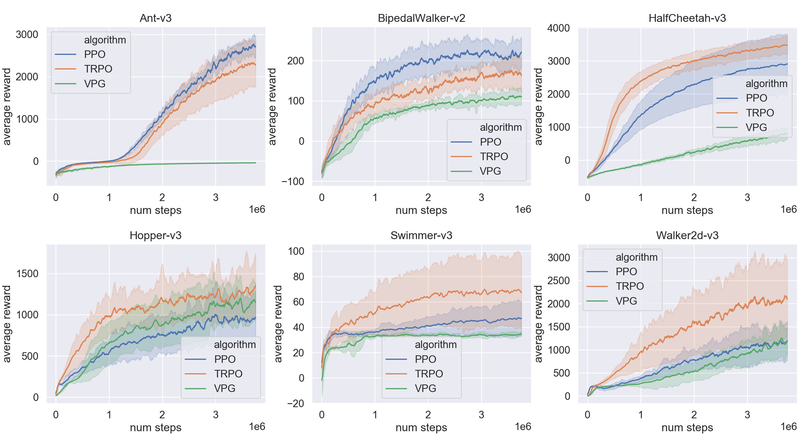

# About Deep Reinforcement Learning

<!-- 强化学习和深度学习的结合产生了一系列重要的算法，本项目将着重参考相关 paper 并尽可能实现相关算法，这里使用的深度学习框架是 [Pytorch](https://pytorch.org/)。 -->
The combination of Reinforcement Learning and Deep Learning produces a series of important algorithms. This project will focus on referring to 
relevant papers and implementing relevant algorithms as far as possible. 

The deep learning framework used here is : [Pytorch](https://pytorch.org/).

## 1.Why do this?

<!--
尽管在 `Github` 上可以看到需要基于该框架的实现。自己动手实现，包括调试以及跑实验……，这个完整的过程，会使得对于算法的理解，以及算法的细微末节处可能遇到的问题更清楚，
从宏观上，你仍然可以参考其他人的实现，但永远不可以简单地 `copy & paste`，学习这个过程，别人永远无法替你完成。当然，你也会遇到一些问题，
亲自解决这些问题使得你今后对于算法的调试有许多帮助。

从头开始的另一个好处，就是你能把握整个知识脉络，由简单到复杂，性能对比，能够做到心中有数。我的实际使用中会涉及到调用相关的算法，但很难受的是，我一上手
就去调用人家写的东西，实验效果不理想，而无从调试，也不知道问题出在哪里。这就是用别人的东西存在的问题，调用高质量的库能够节省时间也能保证质量，但前提是
————你了解细节，你已经具备基础。
-->

- Implementing all of this algorithms from scratch really helps you with your **parameter tuning**; 
- The coding process allows you to **better understand** the **principles** of the algorithm.

## 2.Lists of Algorithms

| No. | Status | Algorithm | Paper |
| --- | --- | --------- | ----- |
| 1 | :white_check_mark: | [Naive DQN][2] | [Playing Atari with Deep Reinforcement Learning](https://arxiv.org/abs/1312.5602) |
| 2 | :white_check_mark: | [Double DQN][3] | [Deep Reinforcement Learning with Double Q-learning](https://arxiv.org/abs/1509.06461) |
| 3 | :white_check_mark: | [Dueling DQN][4] | [Dueling Network Architectures for Deep Reinforcement Learning](https://arxiv.org/abs/1511.06581) |
| 4 | :white_check_mark: | [REINFORCE][9] | [Policy Gradient Methods for Reinforcement Learning with Function Approximation](https://papers.nips.cc/paper/1713-policy-gradient-methods-for-reinforcement-learning-with-function-approximation.pdf) |
| 5 | :white_check_mark: | [VPG(Vanilla Policy Gradient)][10] |  |
| 6 | <ul><li>- [ ] </li></ul> | AC(Actor Critic) |  |
| 7 | <ul><li>- [ ] </li></ul> | A3C |  |
| 8 | <ul><li>- [ ] </li></ul> | A2C |  |
| 9 | <ul><li>- [ ] </li></ul> | DPG | [Deterministic Policy Gradient Algorithms](http://proceedings.mlr.press/v32/silver14.pdf) |
| 10 | :white_check_mark: | [DDPG][13] | [Continuous Control With Deep Reinforcement Learning](https://arxiv.org/abs/1509.02971) |
| 11 | <ul><li>- [ ] </li></ul> | D4PG |  |
| 12 | <ul><li>- [ ] </li></ul> | MADDPG |  |
| 13 | :white_check_mark: | [TRPO][12] | [Trust Region Policy Optimization](https://arxiv.org/abs/1502.05477) |
| 14 | :white_check_mark: | [PPO][11] | [Proximal Policy Optimization Algorithms](https://arxiv.org/abs/1707.06347) |
| 15 | <ul><li>- [ ] </li></ul> | ACER |  |
| 16 | <ul><li>- [ ] </li></ul> | ACTKR |  |
| 17 | <ul><li>- [ ] </li></ul> | SAC |  |
| 18 | <ul><li>- [ ] </li></ul> | SAC with Automatically Adjusted Temperature |
| 19 | :white_check_mark: | [TD3(Twin Delayed DDPG)][14] | [Addressing Function Approximation Error in Actor-Critic Methods](https://arxiv.org/abs/1802.09477) |
| 20 | <ul><li>- [ ] </li></ul> | SVPG |  |
| 21 | <ul><li>- [ ] </li></ul> | IMPALA |  |

  
<!-- 
1. [DQN系列][1]
    - [Naive DQN][2]
    - [Double DQN][3]
    - [Dueling DQN][4]
    
2. [Policy Gradient系列][8]
    - [REINFORCE][9]
    - [VPG (Vanilla Policy Gradient)][10]
    - [PPO (Proximal Policy Optimization)][11]
    - [TRPO (Trust Region Policy Optimization)][12]
    - [DDPG (Deep Deterministic Policy Gradient)][13]
    - [TD3 (Twin Delayed DDPG)][14]
-->

## 3.Experiments

### 3.1 [Deep Q-Learning(DQN)][1]:

- *DQNs on CartPole-v0*

    

        
        
        
    

### 3.2 [Policy Gradient(PG)][8]:

- *REINFORCE on MountainCar-v0*
    
    

        
        
        
    

- *PPO on BipedalWalker-v2*:

    

        
        
        
    

- PGs on Mujoco

[1]: DQN
[2]: DQN/NaiveDQN.py
[3]: DQN/DoubleDQN.py
[4]: DQN/DuelingDQN.py
[5]: DQN/images/DQN.png
[6]: DQN/images/DDQN.png
[7]: DQN/images/DuelingDQN.png
[8]: PolicyGradient
[9]: PolicyGradient/REINFORCE
[10]: PolicyGradient/VPG
[11]: PolicyGradient/PPO
[12]: PolicyGradient/TRPO
[13]: PolicyGradient/DDPG
[14]: PolicyGradient/TD3
