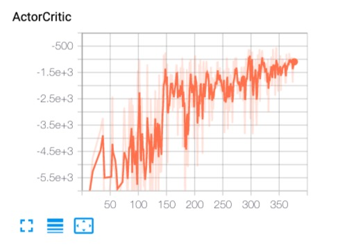

# About Deep Reinforcement Learning

强化学习和深度学习的结合产生了一系列重要的算法，本项目将着重参考相关paper并尽可能实现相关算法，这里使用的主要深度学习框架是[Pytorch](https://pytorch.org/)。

## 1.为什么要自己写这些已有的东西？

尽管在Github上可以看到需要基于该框架的实现。自己动手实现，包括调试以及跑实验……，这个完整的过程，会使得对于算法的理解，以及算法的细微末节处可能遇到的问题更清楚，
从宏观上，你仍然可以参考其他人的实现，但永远不可以简单地 copy & paste，学习这个过程，别人永远无法替你完成。当然，你也会遇到一些问题，
亲自解决这些问题使得你今后对于算法的调试有许多帮助。

从头开始的另一个好处，就是你能把握整个知识脉络，由简单到复杂，性能对比，能够做到心中有数。我的实际使用中会涉及到调用相关的算法，但很难受的是，我一上手
就去调用人家写的东西，实验效果不理想，而无从调试，也不知道问题出在哪里。这就是用别人的东西存在的问题，调用高质量的库能够节省时间也能保证质量，但前提是
————你了解细节，你已经具备基础。

## 2.实验效果

*DQNs on CartPole-v0*:

    
    
    

*REINFORCE on MountainCar-v0*:

    
    
    

*PPO on BipedalWalker-v2*:

    
    
    

*PPO on Mujoco*:

![16]

*Actor-Critics on MountainCar-v0*:

    

*TRPO on Mujoco*:

## 1.算法列表
1. [DQN系列(Naive DQN, Double DQN, Dueling DQN etc.)][1]
    - [Naive DQN][2]
    - [Double DQN][3]
    - [Dueling DQN][4]
    
2. [Policy Gradient系列(Reinforce, Vanilla PG, TRPO, PPO etc.)][8]
    - [REINFORCE][10]
    - [VPG (Vanilla Policy Gradient)][12]
    - [PPO (Proximal Policy Optimization)][15]
    - [TRPO (Trust Region Policy Optimization)][17]

3. [Actor-Critic系列][13]
    - [Actor-Critic][14]

[1]: DQN
[2]: DQN/NaiveDQN.py
[3]: DQN/DoubleDQN.py
[4]: DQN/DuelingDQN.py
[5]: DQN/images/DQN.png
[6]: DQN/images/DDQN.png
[7]: DQN/images/DuelingDQN.png
[8]: PolicyGradient
[9]: PolicyGradient/images/Reinforce%20MountainCar-v0.png
[10]: PolicyGradient/REINFORCE/REINFORCE.py
[11]: PolicyGradient/images/reinforce-mountaincar.gif
[12]: PolicyGradient/VPG
[13]: ActorCritic
[14]: ActorCritic/Actor_Critic.py
[15]: PolicyGradient/PPO
[16]: PolicyGradient/images/ppo_bench.png
[17]: PolicyGradient/TRPO
