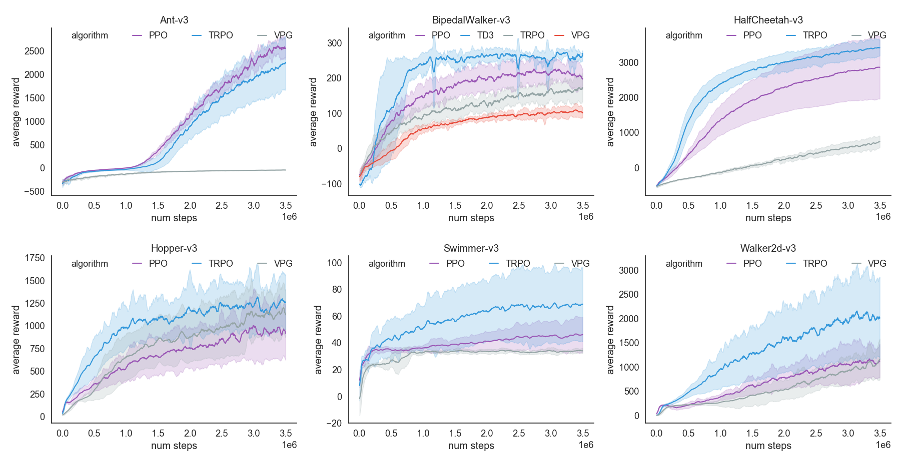

# About Deep Reinforcement Learning

The combination of Reinforcement Learning and Deep Learning produces a series of important algorithms. This project will focus on referring to 
relevant papers and implementing relevant algorithms as far as possible. 

The deep learning framework used here is : [Pytorch](https://pytorch.org/).


## 1.Why do this?

- Implementing all of this algorithms from scratch really helps you with your **parameter tuning**; 
- The coding process allows you to **better understand** the **principles** of the algorithm.

## 2.Lists of Algorithms

| No. | Status | Algorithm | Paper |
| --- | --- | --------- | ----- |
| 1 | :white_check_mark: | [DQN][2] | [Playing Atari with Deep Reinforcement Learning](https://arxiv.org/abs/1312.5602) |
| 2 | :white_check_mark: | [Double DQN][3] | [Deep Reinforcement Learning with Double Q-learning](https://arxiv.org/abs/1509.06461) |
| 3 | :white_check_mark: | [Dueling DQN][4] | [Dueling Network Architectures for Deep Reinforcement Learning](https://arxiv.org/abs/1511.06581) |
| 4 | :white_check_mark: | [REINFORCE][6] | [Policy Gradient Methods for Reinforcement Learning with Function Approximation](https://papers.nips.cc/paper/1713-policy-gradient-methods-for-reinforcement-learning-with-function-approximation.pdf) |
| 5 | :white_check_mark: | [VPG(Vanilla Policy Gradient)][7] | [High Dimensional Continuous Control Using Generalized Advantage Estimation](https://arxiv.org/abs/1506.02438) |
| 6 | <ul><li>- [ ] </li></ul> | A3C |  |
| 7 | <ul><li>- [ ] </li></ul> | A2C |  |
| 8 | <ul><li>- [ ] </li></ul> | DPG | [Deterministic Policy Gradient Algorithms](http://proceedings.mlr.press/v32/silver14.pdf) |
| 9 | :white_check_mark: | [DDPG][10] | [Continuous Control With Deep Reinforcement Learning](https://arxiv.org/abs/1509.02971) |
| 10 | <ul><li>- [ ] </li></ul> | D4PG |  |
| 11 | <ul><li>- [ ] </li></ul> | MADDPG |  |
| 12 | :white_check_mark: | [TRPO][9] | [Trust Region Policy Optimization](https://arxiv.org/abs/1502.05477) |
| 13 | :white_check_mark: | [PPO][8] | [Proximal Policy Optimization Algorithms](https://arxiv.org/abs/1707.06347) |
| 14 | <ul><li>- [ ] </li></ul> | ACER |  |
| 15 | <ul><li>- [ ] </li></ul> | ACTKR |  |
| 16 | <ul><li>- [ ] </li></ul> | SAC |  |
| 17 | <ul><li>- [ ] </li></ul> | SAC with Automatically Adjusted Temperature |
| 18 | :white_check_mark: | [TD3(Twin Delayed DDPG)][11] | [Addressing Function Approximation Error in Actor-Critic Methods](https://arxiv.org/abs/1802.09477) |
| 19 | <ul><li>- [ ] </li></ul> | SVPG |  |
| 20 | <ul><li>- [ ] </li></ul> | IMPALA |  |

  
<!-- 
1. [DQN系列][1]
    - [Naive DQN][2]
    - [Double DQN][3]
    - [Dueling DQN][4]
    
2. [Policy Gradient系列][8]
    - [REINFORCE][9]
    - [VPG (Vanilla Policy Gradient)][10]
    - [PPO (Proximal Policy Optimization)][11]
    - [TRPO (Trust Region Policy Optimization)][12]
    - [DDPG (Deep Deterministic Policy Gradient)][13]
    - [TD3 (Twin Delayed DDPG)][14]
-->

<!--
### 3.1 [Deep Q-Learning(DQN)][1]:

- *DQNs on CartPole-v0*

    <p float="left">
        
        
        
    </p>

### 3.2 [Policy Gradient(PG)][8]:

- *REINFORCE on MountainCar-v0*
    
    <p float="left">
        
        
        
    </p>

- *PPO on BipedalWalker-v2*:

    <p float="left">
        
        
        
    </p>
-->

### 3.Project Dependencies

- Python >=3.6  
- Pytorch >= 1.3.1  
- Seaborn >= 0.10.0  
- Click >= 7.0  

### 4.Run

Each algorithm is implemented in a single package including:
```
main.py --A minimal executable example for algorithm  
[algorithm].py --Main body for algorithm implementation  
test.py --Loading pretrained model and test performance of the algorithm
[algorithm]_step.py --Algorithm update core step 
````
The default `main.py` is a an executable example, the parameters are parsed by [click](https://click.palletsprojects.com/en/7.x/).

You can run algorithm from the  `main.py` or `bash scripts`. 
- You can simply type `python main.py --help` in the algorithm package to view all parameters. 
- The directory [Scripts](Scripts) gives some bash scripts, you can modify them at will.

### 5.Visualization of performance

[Utils/plot_util.py](Utils/plot_util.py) provide a simple plot tool based on `Seaborn` and `Matplotlib`.
All the plots in this project are drawn by this plot util.

#### 5.1 Benchmarks for DQNs


 
#### 5.2 Benchmarks for PolicyGradients




[1]: DQN
[2]: DQN/DQN
[3]: DQN/DoubleDQN
[4]: DQN/DuelingDQN
[5]: PolicyGradient
[6]: PolicyGradient/REINFORCE
[7]: PolicyGradient/VPG
[8]: PolicyGradient/PPO
[9]: PolicyGradient/TRPO
[10]: PolicyGradient/DDPG
[11]: PolicyGradient/TD3
